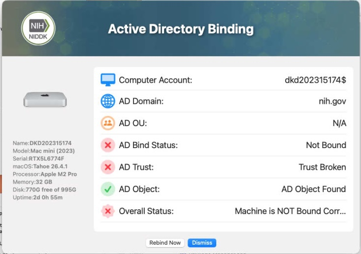

## Active-Directory-Binding-Check
Lightweight Script to check needed Active Directory Status information 

Purpose: checking common AD status 
Usecase: HelpDesk staff to verify AD bidning status of macs on NIH net

NOTES::
 - This is a lightweight script to check the most commom active directory status informaiton for my organization.
 - Requires NIH Domain Connection
 - Will require a Jamf policy trigger to run a separate policy to actually do the unbinding and binding if required 

| **Version**|**Notes**|
|:--------:|-----|
| 1.0 | Initial - no Notating before git changes
| 1.0 | Added jamf policy -trigger '
||       Fixed Some Notations
||       Adjusted some spacing 
